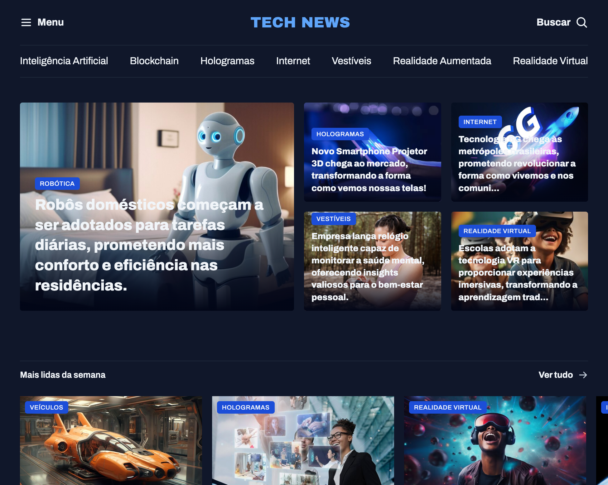

# Página de Portal de Notícia

> Full-Stack - Projeto de Portal de Notícia

projeto para criar um site de notícias estilizado pela rocketseat.

## 👨‍💻 Tecnologia

- HTML
- CSS
- Git e Github

# 💭 O que aprendi?

Neste projeto aprendi a fazer códigos mais limpos e organizados separando em vários arquivos de CSS em uma pasta estilizada para que assim fosse mais fácil a leitura e organização da estilização da página em si.

## 📚 Contato

- e-mail: lucas.primati@hotmail.com
- github: [🔗 github](https://github.com/luprime)
- Linkdedl: [🔗 Linkedln](https://www.linkedin.com/in/lucas-primati/)